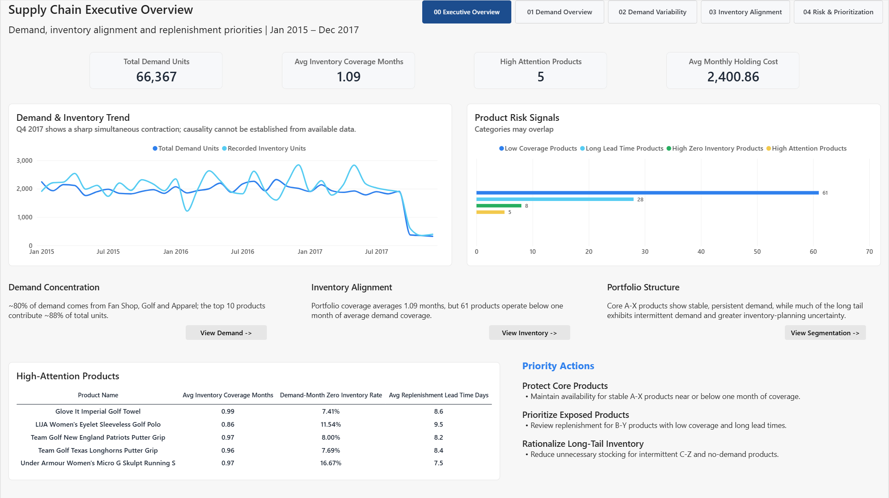

# Supply Chain Inventory Prioritization Analytics | Power BI

An end-to-end Power BI project analyzing demand concentration, inventory alignment, demand variability, replenishment exposure, and SKU-level supply-chain priorities.

## Dashboard

**Live Power BI Report:** [View interactive dashboard](YOUR_POWER_BI_LINK)

## Project Overview

This project analyzes demand, inventory, and replenishment data for **Just In Time**, a fictional supply-chain company, using Power BI.

The objective was not simply to build an operational dashboard, but to create a decision-oriented analytical framework that helps stakeholders understand:

1. Where demand is coming from
2. Whether inventory is aligned with demand
3. Where replenishment and service-risk exposure is concentrated
4. Which products should receive management attention

The final report includes an executive landing page, four analytical deep dives, and a product-level drill-through page.

---

## Dataset

Three source datasets were provided at different grains:

| Dataset | Grain | Main Information |
|---|---|---|
| Orders & Shipments | One row per order item | Demand, customer, product, sales, shipment |
| Inventory | One row per product-month | Monthly inventory level and holding cost per unit |
| Fulfillment | One row per product | Replenishment lead time |

The final analytical model contains:

- **30,871 order-item records**
- **4,200 inventory product-month records**
- **118 products**
- **36 months from January 2015 to December 2017**

Because the source tables were recorded at different grains, they were not directly merged into one flat table.

---

## Data Model

I built a star-schema-style semantic model with:

- `FactOrders` — order-item level
- `FactInventory` — product-month level
- `DimProduct` — product attributes and replenishment lead time
- `DimMonth` — common monthly calendar dimension

Both fact tables are connected through shared Product and Month dimensions using one-to-many, single-direction relationships.

This preserves each dataset's original analytical grain and avoids duplicating monthly inventory values across order-item records.

---

## Data Preparation & Validation

Power Query was used to:

- Standardize column names and text values
- Reconstruct Order Date and Shipment Date
- Create a standardized `YearMonthKey`
- Convert discount values into a numeric analytical field
- Validate Product × Month uniqueness in inventory
- Validate Product uniqueness in fulfillment
- Check cross-table referential integrity
- Flag invalid shipment dates and inventory conditions

A separate hidden QA page documents the major validation results.

### Key data-quality findings

- **0 duplicate Order Item IDs**
- **0 duplicate Product-Month inventory records**
- **0 unmatched Product or Month relationship keys**
- **48 expected Product-Month inventory combinations are missing**
- **2,735 shipment records (8.86%) have Shipment Date earlier than Order Date**
- **6,896 records (22.34%) report Profit greater than Gross Sales**
- **5 stocked products have no observed demand in the available order history**

Shipment-performance KPIs and profit-margin analysis were therefore excluded from the primary business recommendations rather than repaired using unsupported assumptions.

Zero inventory was retained as a meaningful observation, while missing inventory records were kept distinct from zero inventory.

---

## Analytical Framework

### 1. Demand Overview

Demand was analyzed across time, product departments, individual products, and customer markets.

Key findings:

- **66,367 total demand units** across **11,072 distinct orders**
- Fan Shop, Golf, and Apparel contribute approximately **79.5% of total demand**
- The top 10 products account for approximately **87.7% of total demand**
- LATAM, Europe, and Pacific Asia together contribute approximately **78.0% of demand**

The demand portfolio is therefore highly concentrated in a relatively small number of departments, markets, and SKUs.

---

### 2. Demand Variability & Segmentation

Monthly demand variability was measured using:

- Average Monthly Demand
- Standard Deviation
- Coefficient of Variation (CV)
- Demand Presence Rate

The portfolio contains **113 products with observed demand**.

- Median Demand CV: **2.15**
- Average Demand Presence Rate: **41.6%**

The results indicate a two-speed portfolio:

- Core high-demand products show persistent and relatively stable demand
- A long tail of lower-volume products shows intermittent and highly variable demand

#### Demand ABC classification

Products were ranked by cumulative demand-unit contribution:

- **A:** first 80% of cumulative demand
- **B:** 80–95%
- **C:** remaining demand

The classification is explicitly demand-based rather than revenue-based.

#### XYZ classification

XYZ classification was based on observed CV distribution:

- **X:** CV ≤ 0.5 — stable
- **Y:** 0.5 < CV ≤ 1.5 — moderately variable
- **Z:** CV > 1.5 — highly variable / intermittent

The thresholds were chosen after inspecting clear gaps in the empirical CV distribution rather than assuming a universal industry standard.

---

### 3. Inventory & Replenishment Alignment

Demand and inventory were evaluated at a common Product × Month grain.

Key metrics include:

- Average Monthly Inventory
- Inventory-to-Demand Coverage
- Zero-Inventory Product-Month Rate
- Average Monthly Holding Cost
- Replenishment Lead Time

Portfolio-level average inventory coverage is approximately **1.09 months**, but aggregate coverage masks material SKU-level differences.

**61 products operate below one month of average demand coverage.**

Holding-cost Pareto analysis also shows that carrying cost is concentrated in a relatively small number of core products. Because many of these products are also major demand drivers, inventory-cost reduction should be balanced against availability risk rather than implemented through blanket stock reductions.

### Inventory coverage limitation

The source defines Warehouse Inventory only as a monthly inventory level and does not specify whether it represents beginning, ending, or average inventory.

Therefore, the coverage metric is treated as a **relative inventory-to-demand alignment proxy**, not as a precise operational months-of-supply measure.

---

### 4. Product Risk & Prioritization

Service-risk exposure was refined by measuring zero inventory only during months in which both demand and an inventory record were observed.

The prioritization framework combines:

- Demand importance (`Demand ABC Class`)
- Demand variability (`XYZ Class`)
- Inventory coverage
- Demand-month zero-inventory exposure
- Replenishment lead time

The final dashboard identifies:

- **61 Low-Coverage Products**
- **28 Long-Lead-Time Products**
- **8 High Zero-Inventory Exposure Products**
- **5 High-Attention Products**

Priority tiers are rule-based and transparent rather than generated through an opaque weighted score.

---

## Recommendations

### Protect Core A-X Products

Maintain high availability for stable, high-demand A-X products, particularly products operating close to or below one month of inventory coverage.

Their stable demand makes proactive replenishment planning more feasible, while their high business importance increases the cost of availability failures.

### Manage Exposed B-Y Products

Review reorder points and replenishment frequency for B-Y products that combine limited inventory coverage with longer replenishment lead times.

These products have meaningful demand but less recovery flexibility than the stable A-X core.

### Rationalize the C-Z Long Tail

Use smaller replenishment quantities and periodic assortment reviews for low-importance, highly intermittent products.

The five stocked products with no observed demand should also be reviewed to confirm whether continued inventory commitments are intentional.

---

## Q4 2017 Structural Shift

Q4 2017 shows a sharp contraction in both demand and recorded inventory.

Demand declined approximately **81.5% versus Q3**, while average monthly inventory declined roughly **77%**.

However, the available dataset does not contain sufficient evidence to establish inventory shortages as the sole cause. Potential explanations could include changes in demand, assortment, supply availability, or source/data-generation processes.

The period was therefore retained in the analysis and documented as an analytical limitation rather than being automatically removed.

---

## Report Structure

- **00 Executive Overview** — management-facing summary of demand, inventory and priority signals
- **01 Demand Overview** — demand concentration across time, products and markets
- **02 Demand Variability** — CV, demand presence and ABC-XYZ segmentation
- **03 Inventory Alignment** — demand coverage, holding-cost concentration and replenishment
- **04 Risk & Prioritization** — product-level risk signals and management priorities
- **Product Detail** — hidden drill-through page for individual SKU investigation
- **QA & Validation** — hidden internal validation page

The report includes page navigation, reset-filter controls, tooltips, drill-through functionality and product-level detail views.

---

## Tools & Techniques

- Power BI
- Power Query / M
- DAX
- Dimensional data modeling
- Star schema
- Data-quality validation
- ABC-XYZ segmentation
- Demand variability analysis
- Pareto analysis
- Inventory-to-demand alignment
- Rule-based product prioritization
- Drill-through and interactive dashboard design

---

## Key Takeaway

The analysis shows that supply-chain risk cannot be assessed from demand volume or inventory levels in isolation.

The most useful prioritization comes from combining:

**Demand Importance × Demand Predictability × Inventory Position × Replenishment Flexibility**

This framework helps distinguish stable core products that require availability protection from exposed mid-tier products that require closer replenishment monitoring and intermittent long-tail products where excess inventory should be controlled.
